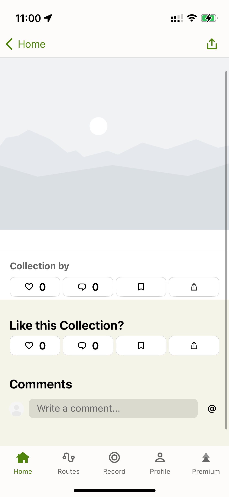
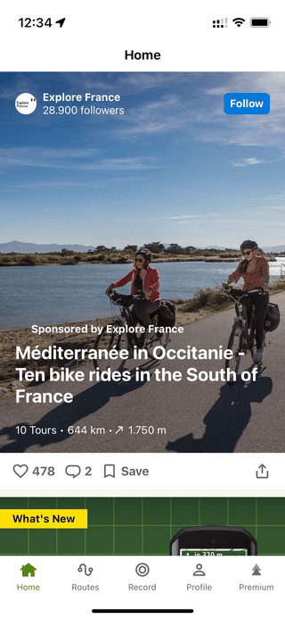
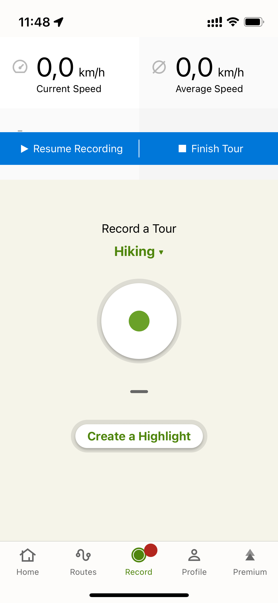
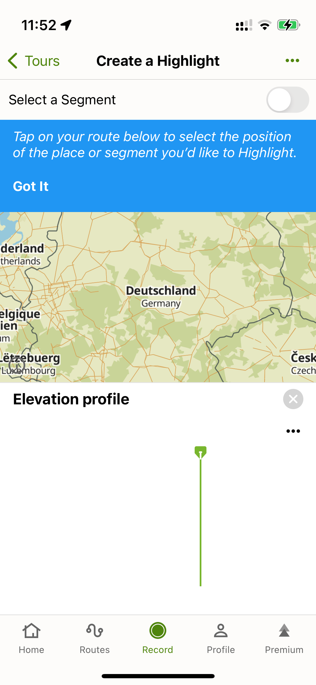

# Komoot Senior iOS Developer Challenge

I pursue two goals with this repository:
- to summarize my thoughts on the challenge itself
- to share my hiring experience with Komoot for Senior iOS Developer role

The former is primarily important to me because it allows me to collect and document all my thoughts on the technical part in one place. It can also provide good guidance for someone else implementation. 
Feel free to use this code as a starting point.

The latter may be very helpful to others who are considering Koomot as a future employer. 

I hope that this public review could possibly lead to hiring process improvements in Komoot and make someone think twice before investing their priceless time into working on the challenge for free.

## Challenge

Let's start with a few statements from the Komoot team on the challenge before diving into a description.

> **Will you get feedback?**
>
> Yes. All submissions will receive thorough and constructive feedback, regardless of the outcome.

I want to highlight that there is a promise to provide **thorough** feedback to everyone who submits their solution.

> **What is the “challenge“ and why do you ask to submit one?**
>
> The challenge is a real world task that we have often worked on and solved in the past ourselves. It can be anything from suggesting process improvements to a small coding task.
> The challenge is designed by our hiring team to let you showcase your skills in a real world scenario – we like receiving good CVs but we’re also interested in seeing your skills in action.
> It should normally take around **half a day** to complete, but some challenges may take longer.
> **In addition to your solution, we’re also interested in your thought process, your technical abilities, approach to research, creativity, written communication, summarizing abilities and how you present your ideas.**
> Often we don’t give too much detail here because we want to see how you go about solving the challenge.
> However, if you have questions or need more time, please ask – we want to enable you to do your best work here.

> [!TIP]
> It's super important to keep this information in mind. I'm surprised it is only mentioned on their [webpage](https://www.komoot.com/jobs-process) but not in the description or supplementary document they share with candidates.

Ideally, a candidate must be able to complete his solution in four hours or so. You should also demonstrate your thought process and presentation skills. 
This is not mentioned and communicated with you directly; instead, it shows your research abilities to find out this information on your own.

### What is the challenge?

Let's take a look at the challenge description and requirements.

**Develop an iPhone app that enables you to track your walk with images.**

The user opens the app and presses the start button. After that the user puts their phone into their pocket and starts walking. The app requests a photo from the Flickr photo search api every 100 meters to add to the stream. New pictures are added on top. Whenever the user takes a look at their phone, they see the most recent picture and can scroll through a stream of pictures which shows where the user has been. It should work for at least a two-hour walk.

**What are we looking for?**

Successful submissions usually take around half a day to complete.
Please block some time during the next few days and, if you need more than a week to return the challenge to us, please keep us up to date via email.
We would love to see a properly working application written in
Swift. You are free to decide on any architecture.

Please don't use 3rd party code.

**What to deliver?**

Send us via email
- the Xcode project sources as a zip file
- a summary of your decisions and learnings while developing

**What can you expect?**

We usually take 2 working days for our evaluation including testing the feature behaviour and reviewing code base.
If we aren't convinced by your solution you will get a detailed summary and explanation of the problems we found.

### My thoughts

The challenge itself looks very simple on the surface but contains many corner cases. That's cool. It allows you to demonstrate what you are paying attention to. 

You can test a test app using the built-in Xcode tools to simulate location, but I actually tested it outside. 
It was a pure pleasure to check the result of your work in such a way. 
This is a big plus; the challenge can push you to go outside! It really makes sense for a company like Komoot.

Overall, it is a really good challenge. Unsurprisingly, they haven't changed it over the last five years or even more.

## Challenge accepted

I suggest starting our talk on implementation with one thing that defines how the whole challenge must be approached.

> [!IMPORTANT]
> Please don't use 3rd party code.

We are not allowed to use any third-party code. If you have a template project under your belt, you are lucky enough to bootstrap your development very fast and not waste time on core building blocks. For anyone else, it only means you'll require more than four hours to finish the challenge.

It makes sense to implement core components as simply as possible, omitting many details that make sense in a production app but will take some time to implement. There is always an option to copy-paste some code from the popular frameworks, but for what reason?

When such a restriction is considered, the first idea that comes to mind is to build a UI using SwiftUI. It is way faster to code the whole UI using SwiftUI than vanilla UIKit. Except for some limitations of `AsyncImage`, it is a reasonable choice. `AsyncImage`'s limitations include its inability to cache downloaded images and to retry failed image downloads.

Working with `CoreLocation` is pretty straightforward, and I don't see any benefits any wrapper framework can bring, so that's good for us.

Networking can be implemented using `URLSession`, which is also quite simple to use for the purpose of the challenge. The only limitation is that out of the box, there is no retries support for failed requests.
We also have to write some code if we would like to monitor the network state and type to perform any optimizations based on them.

### Key areas of focus

Let's highlight the areas we should focus on to build our app. 
We must deal with location services, networking, Flickr API, UI, testing, and optimizations to preserve battery and network resources.

#### Location services

`.authorizedWhenInUse` level of authorization is enough for the challenge purposes. `NSLocationWhenInUseUsageDescription` must be provided in the `Info.plist` with some explanatory text.

To receive location updates in the background, we should add the `Location updates` option to a list of our app's background modes.

The key to working with the location services is to actively monitor the authorization status, as it can change at any point while the app is running.

The location services can provide us with location points close to each other; we are responsible for filtering them according to the desired distance between them.

`CLLocationManager` supports the [pausesLocationUpdatesAutomatically](https://developer.apple.com/documentation/corelocation/cllocationmanager/pauseslocationupdatesautomatically) option to pause location updates when there have been no significant changes in the device's location for a period of time to preserve battery resources. I'll touch on this topic more deeply in the [optimization section](#optimizations).

> [!NOTE]
> Core Location calls the methods of your delegate object using the RunLoop of the thread on which you initialized the CLLocationManager object.
> That thread must itself have an active RunLoop, like the one found in your app’s main thread.

It is also worth mentioning that `CLLocationManager` delivers messages to its delegate on the thread where the particular `CLLocationManager` was created. 
If the main thread needs to be offloaded from such messages, we can create a separate thread, attach some source to the `RunLoop`, and run the `RunLoop`. 
One can remember the same trick for `NSURLConnection`.

#### Networking

I have nothing new to add here. Custom retry policies and tracking network availability may be needed, but other than that, the right way to handle general errors must be chosen.

#### Flickr API

[flickr.photos.search](https://www.flickr.com/services/api/flickr.photos.search.html) endpoint is what we need to get photos for a specific location.

There are a few parameters I would like to focus on:
* `radius` - defines a radius for a search; the smaller the value, lesser results we will receive
* `per_page` - defines the number of photos to be returned; it equals 100 by default, and we don't require such a crazy amount to pick just one photo
* `bbox` - defines a geographical area to perform a photo search — more on that in the [optimization section](#optimizations).

There are also a few things to consider when working with Flickr API:
* empty response is normal; there is no guarantee that for every location point, there will be at least one photo returned
* responses for two location points that are not too far from each other may contain the same photos; we should be aware of possible duplicates

#### UI

There are three main focus areas for the UI, in my opinion:
* make sure that every possible state is covered
* custom image view and image cache/processor
* localization

As for the states, there are plenty of them, and we should ideally support all of them:
* intro
* no location services access
* empty timeline
* loading timeline
* in progress timeline
* finished timeline
* in progress API request
* API request error
* in progress image download
* image download error
* airplane mode

Image displaying is a complicated topic. We can outline the requirements:
* support loading state
* support error state with a possibility to manually retry downloading by pressing a button
* support automatic retry logic for image downloading in case of non-critical errors
* support download cancellation if the view is no longer in a hierarchy 
* download an image of the optimal size (minimizing network and memory footprint is necessary) based on the self-bounds. Flickr provides plenty of size options to choose from.
* perform decoding/resizing/transformation of the downloaded image on a background thread
* cache processed images in the LRU cache with configurable constraints

#### Testing

There are two types of tests to consider:
* UI tests verify that UI correctly reflects all the possible states
* Unit tests verify that components worked as expected based on a different input. The use of DI principles and abstractions is essential to supporting this kind of testing

#### Optimizations

1. As I mentioned before, `CLLocationManager` supports location updates pausing when there are no significant device movements over longer period of time.
   It's beneficial to support such a feature in an app that can be run for hours. We must request the `.authorizedAlways` authorization level to properly support this feature,
    as with the  `.authorizedWhenInUse` authorization level, we won't be able to restart location updates - app restart is required.
   Then implement `locationManagerDidPauseLocationUpdates(_:)` delegate method and create `UNLocationNotificationTrigger` to notify us when the user has finally started movement.
2. Our app can be used in both foreground and background modes. However, it is evident that it is intended to be used primarily in the background mode most of the time.
   That means we keep this fact in mind while building our implementation. Requesting images from the Flickr API one by one once we receive a location update is suboptimal.
   It consumes more resources and introduces a higher server load than an alternative approach. The better way is to put all location updates that are received in the background into a queue, and when our app moves to the background, we calculate a bounding box based on these locations and perform only one network request to the Flickr API specifying `bbox` and `per_page` parameters.
   We can apply the same logic even for the foreground mode if a device is in the low power mode by performing a network request only when we have N location updates in the queue.
3. Images can be downloaded at appropriate [sizes](https://www.flickr.com/services/api/misc.urls.html); we don't need an original-sized image to be displayed as a small thumbnail in our UI.

### Open questions

1. **Does allowing users to track their path while their device is in Airplane mode make sense?**\
   Since our app's main functionality is to provide a user with pictures, without network access, it becomes useless.
   A few strategies can be applied here, and it's worth to understand what brings value to the users.
2. **Should we display anything in the UI for the location points without images from Flickr API?**\
   Flickr API doesn't guarantee the return of at least one image for any location point so that we can end up without a photo or photos for the whole track.
   As an option, we can display a placeholder image for each location without an image from Flickr API.
3. **How should API network call errors be handled?**\
   The user's device may have a poor network connection or the API server may encounter some problems; regardless of the reason, we can end up without a proper response.
   Should we allow failed requests to be retried manually? What if there were a lot of them.
4. **How should we select the image to be displayed from Flickr API?**\
   As we always request images in pages, multiple results may be returned, but what's the right way to pick one? We can pick a random one or one that is geographically close to the location it was requested for.

## My interviewing experience

I applied for this position twice this year, and here is a timeline:

1. Applied in June 2024; rejected the next day.
2. Applied for the second time in October 2024; rejected in six days; a few weeks later, I was asked if I'd like to proceed :man_shrugging:;
   received an invitation for a call for a different position :exclamation:; after two :bangbang: follow-up emails I finally received a correct link;
   had a 15 minutes screening call with their iOS Team Lead; completed a challenge and got rejected.

Well, it was a big surprise to me that such a small company can get confused with the invitation link, and it takes 6 working days to get the correct one. 
I'm emphasizing this because it was my first time encountering something like this this year.

#### What does the application process look like?

The application process is not as simple as attaching a CV and cover letter. You already have to invest some time in this step.

They ask questions that require some time to think about:
* Tell us in three sentences what excites you about working with komoot.
* Tell us briefly why you think this is the right role for you.
* Briefly tell us about your favorite experience working in a cross-functional  team to achieve a common goal. What were your role and responsibilities, and how did you contribute to the team's success?

In addition, there are a few technical questions, but they are relatively easy and fast to answer.

### Was I good enough with the challenge?

Well, definitely not. Otherwise, such a reflection wouldn't make sense. Initially, I didn't set up any time constraints for myself; it was obvious that the challenge would take more than four hours. 
It isn't all about coding; you have to think a lot about the task, find out what can go wrong, choose the right tools, and figure out the best abstractions to reach a goal.

It's essential to define a time boundary that you will not cross—the moment at which you will stop and send your solution. 
I had this boundary of other life commitments that I couldn't put off. While I had many corner cases in mind, I couldn't implement all of them in the timeframe I had. 
I find it incredible to push your limits and show all the best you can make, but without any guarantees of success, it is silly to put a lot of effort into such challenges, in my opinion.

I made one big mistake. I was so overwhelmed with the idea of finally sending my submission after the final test that I absolutely forgot to provide a summary of my decisions and learnings while developing.

I actually wrote a little bit about the challenges and some improvements, but it wasn't as extensive as this one.

> Hi,
> 
> I've just returned from my second short walk to test an application. And you know, I think that's the coolest part about the test project. I don't know if it is intended to go outside to play with what you build, but it makes a lot of sense for a company like Komoot.
> 
> It took more time than I initially thought required to finish the test project. While I finished at a point where it has a decent quality, there are a bunch of things to implement to make the app shine. I'll list all the points I'd like to improve with some reasoning behind them.
> 
> I was surprised to see the same task on the test project as five years ago. This time, however, I made it. Technology-wise, it was a time to experiment with technologies I haven't used so much, such as SwiftUI, Combine, and Swift Concurrency.
> 
> So, let me talk about things that I'd like to improve or make differently:
> 
> * Assuming that the application can run for hours in the background mode and the fact that there are such variables as low power mode and bad network connection, I'd reimplement the logic for querying images from a server to a more resource-efficient strategy. While the application is in the background, our app collects location points and makes no network requests until the moment the user brings it back to the foreground; after that, we will calculate the bounding box for the area containing all of the collected locations points and query images for this bounding box (bbox parameter). Such a solution is much better for the battery life and server load compared to network requests every ~100 meters.
> * CLLocationManager can pause itself when there is no device motion for some time. I didn't handle such a scenario, but it requires consideration
> * There is no guarantee that we will receive at least one image for any location point, so an empty timeline is possible. Ideally, some placeholder image should represent the location but not a picture associated with it.
>     For better clarity, it would be nice to have a loading indicator that represents any ongoing network request
> * Network request errors are silently ignored for simplicity. But it's worth implementing a retry policy or adding a queue for processing all unsuccessful requests until the user stops tracking
> * DI can be improved. I ended up having just one container, but ideally, there should be a separate one for each app's module and support for weak singletons to prevent the storage of unnecessary objects forever.
> 
> That's all I was thinking about. I'd appreciate your feedback.

### Feedback

> We acknowledge you have invested a lot of time and effort into this process and I would like to provide you with more in depth feedback.
> 
> What we really appreciated in your challenge was:
> 
> * Your ability to critically asses your own work and identify areas of improvement, evidently you have a growth mindset and understood the design of this challenge really well. We were so happy to see you mention the DI improvement, shows you think ahead and can acknowledge areas of importance.
> 
> What we missed was:
> 
> * User facing feedback is one to mention (error messages or retry buttons). We would have loved to see more suggestions and further demonstrations of problem solving, ways to test the changes etc.

That was a rejection. There's nothing terrible about it. However, I was so frustrated by the amount of feedback provided that it pushed me to spend hours on all these wordings.

> I would like to provide you with more in depth feedback.

Looks like a mockery. Who can consider two sentences as in-depth feedback? There is a company statement to provide you with thorough feedback.
It is publicly available, meaning they should at least follow their commitment.
Don't get me wrong; I'm not the only one with such a problem; look at [Glassdoor reviews](https://www.glassdoor.de/Vorstellungsgespr%C3%A4ch/komoot-Fragen-im-Vorstellungsgespr%C3%A4ch-E1299788.htm).

What kind of suggestions are expected? It's up to your imagination to find answers to this question.

It doesn't look like feedback someone spends more than 15 minutes on. It feels like they have a list of requirements to check for a quick review of each candidate, and that's it. 
No one is interested in providing detailed feedback; it is time-consuming.

I've reviewed test assignments in the past, but the feedback has always been personalised, with references to each assignment's code. That's why I have a good understanding of how in-depth feedback can look.

### Does Komoot iOS app set a standard of excellence in quality?

Based on the feedback I received, the Komoot iOS team seems to have high-quality standards. But is this reflected in their application?

I decided to quickly check how their app deals with user facing feedback. That's what they were missing in my submission.

I performed my checks with **2024.50.0** version.

Let's take a look at the collections screen

Endpoint is `https://api.komoot.de/*/collections/*`

Their default network retry policy is to perform requests three times.

| Unsuccessful Network Request                                         | Incorrect Response                                         |
| -------------------------------------------------------------------- | ---------------------------------------------------------- |
|  |  |

Well, in case of an unsuccessful network request, there is no information about that; the screen is stuck in the loading state, and there is no way to retry manually.

Moreover, they even render some skeletons in case of an invalid JSON response format.

Network retries are not canceled if you leave the screen. If the first request has failed and you leave the screen, a second and third try will still be performed.

Let's take a look at the home screen

Endpoint is `https://feed-api.komoot.de/v1/*/feed`

| Unsuccessful Network Request                                                |
| --------------------------------------------------------------------------- |
|         |

Here, we have the same behavior as with the collections screen. If a server does not respond, the user is not informed, and the pull-to-refresh operation finishes as a successful one.

UI bugs

| Incorrect toolbar position                                         | Empty elevation profile                                         |
| ------------------------------------------------------------------ | --------------------------------------------------------------- |
|  |  |

I don't think any comments are required. Proper testing may reveal much more bugs, but that wasn't my goal. 
I want to highlight that it is a strange move to require from candidates something that your product lacks.

## Conclusion

As you may have noticed, this simple task has many little nuances to consider. There may even be more, which I didn't discover myself. That's the beauty of this challenge.

I wish the Komoot team would follow their commitment to providing candidates with proper feedback in order to respect all the efforts people put into their submissions. Candidates expect thorough feedback. It is not only allowed to highlight someone's mistakes but also teach something new. It is a reward for efforts—the value a candidate can extract from this experience.
